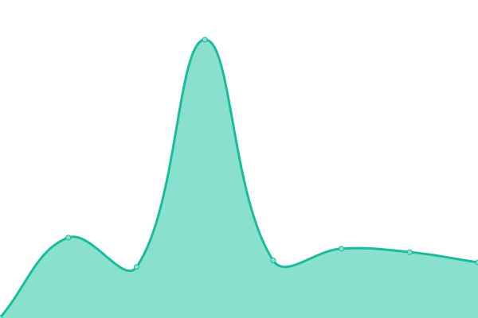
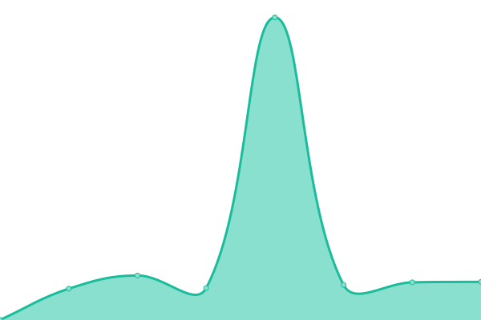
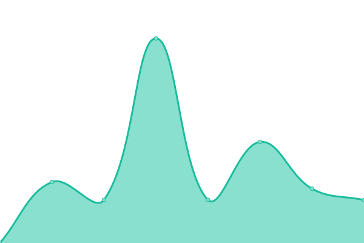

# [📈 Live Status](https://ThatHackerDudeFromCyberspace.github.io/uptime): <!--live status--> **🟩 All systems operational**

This repository contains the open-source uptime monitor and status page for [HackerDude](https://ThatHackerDudeFromCyberspace.github.io/uptime), powered by [Upptime](https://github.com/upptime/upptime).

With [Upptime](https://upptime.js.org), you can get your own unlimited and free uptime monitor and status page, powered entirely by a GitHub repository. We use [Issues](https://github.com/ThatHackerDudeFromCyberspace/uptime/issues) as incident reports, [Actions](https://github.com/ThatHackerDudeFromCyberspace/uptime/actions) as uptime monitors, and [Pages](https://ThatHackerDudeFromCyberspace.github.io/uptime) for the status page.

<!--start: status pages-->
<!-- This summary is generated by Upptime (https://github.com/upptime/upptime) -->
<!-- Do not edit this manually, your changes will be overwritten -->
<!-- prettier-ignore -->
| URL | Status | History | Response Time | Uptime |
| --- | ------ | ------- | ------------- | ------ |
|  [Git](https://git.hackerdude.tech/) | 🟩 Up | [git.yml](https://github.com/ThatHackerDudeFromCyberspace/uptime/commits/HEAD/history/git.yml) | 

 497ms
     
 | 

<a href="https://uptime.hackerdude.tech/history/git">96.92%</a>
    

|  [IoT](https://iot.hackerdude.tech/) | 🟩 Up | [io-t.yml](https://github.com/ThatHackerDudeFromCyberspace/uptime/commits/HEAD/history/io-t.yml) | 

 373ms
     
 | 

<a href="https://uptime.hackerdude.tech/history/io-t">96.92%</a>
    

|  [Mail](https://mail.hackerdude.tech/) | 🟩 Up | [mail.yml](https://github.com/ThatHackerDudeFromCyberspace/uptime/commits/HEAD/history/mail.yml) | 

 577ms
     
 | 

<a href="https://uptime.hackerdude.tech/history/mail">96.92%</a>
    

|  [Watch](https://watch.hackerdude.tech/) | 🟩 Up | [watch.yml](https://github.com/ThatHackerDudeFromCyberspace/uptime/commits/HEAD/history/watch.yml) | 

 473ms
     
 | 

<a href="https://uptime.hackerdude.tech/history/watch">96.92%</a>
    

|  [DTG-Wiki](https://wiki.ducttapedgames.com/) | 🟩 Up | [dtg-wiki.yml](https://github.com/ThatHackerDudeFromCyberspace/uptime/commits/HEAD/history/dtg-wiki.yml) | 

 554ms
     
 | 

<a href="https://uptime.hackerdude.tech/history/dtg-wiki">100.00%</a>
    

<!--end: status pages-->

[**Visit our status website →**](https://ThatHackerDudeFromCyberspace.github.io/uptime)

## 📄 License

- Powered by: [Upptime](https://github.com/upptime/upptime)
- Code: [MIT](./LICENSE) © [Anand Chowdhary](https://anandchowdhary.com), supported by [Pabio](https://pabio.com)
- Data in the `./history` directory: [Open Database License](https://opendatacommons.org/licenses/odbl/1-0/)
